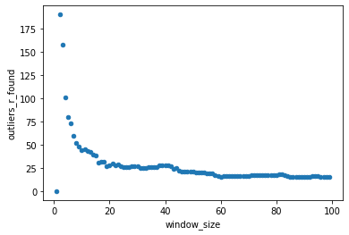
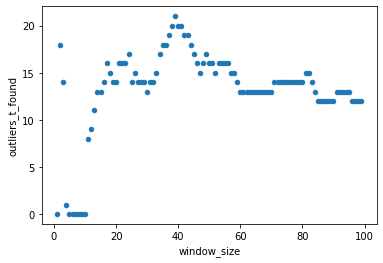

# Outlier Detection in Python

A fun little experiment to find outliers in stock price data in python. In this readme, I'll briefly outline how to get started, some key features and then in the appendix a description of the model methodology.
This application was developed in python 3.9.9 on linux.


## Getting started

- This utility is designed to detect an anomaly for date _t_ on date _t_, thus it is designed to ensure that the model does not incorporate future information (avoid look-ahead bias).
- This utility is to be used primarily as a command line tool.

Running this application is dead simple. First create a virtualenv and install the dependencies.
```bash
python -m venv venv
source venv/bin/activate # linux
venv/scripts/activate # windows
pip install -r requirements.txt
```

>You can just also run `make setup` as a shortcut to the above if you have make within your environment.

Then run as a module invoking the `main` command providing the path to the csv to be process along with the field name of the column with the discrete variable to be evaluated.

```bash
python -m outliers main ./data/Outliers.csv Price
```

### Configurable model parameters
As per the model methodology in the appendix, there is no rule or previous examples to use to define an outlier. I've set the default model parameters to what made sense after trying many different combinations, but this may be subjectively challenged. As such, the CLI `main` command supports a configurable integer for the lookback window to adjust model outlier sensitivity: lower => more sensitive, higher => less sensitive for strategy 1. A boolean for the scoring strategy is also a supported option.

This can be implemented as per below to use 39 days for strategy 2 as an example:
```bash
python -m outliers main ./data/Outliers.csv Price --lookback 39 --inc-current True
```
Other model parameters can be adjusted using the constants in `algorithm.py`, but these would be more advanced configuration, so are not implemented on the CLI.

For other command options just run:

```bash
python -m outliers main --help
```

# Appendix

## Model methodology

As we have an unlabelled dataset, this cannot be treated as a supervised classification problem given that there is neither a hard-and-fast definition of an outlier nor explicit examples. 
Bootstrapping the daily change, we can determine that the data is normally distributed, therefore, for this model, given the univariate input data, I decided to take the approach of calculating a trailing z-score for a given maximum time period with an applied standard deviation threshold of +- 3 that will be used to determine an outlier. 
For Z score calculation there are two strategies availalbe to the model:

1. **Exclude current observation**: We'll calculate the z-score for the previous ***n*** days not including the current observation. To is to avoid the inclusion of the current in its own Z score calculation. This gives us good senstivity to fairly subtle fluctuations while keeping small time windows.
   
2. **Include current observation**: We'll calculate z-score inclusive of current observation. This generally will require larger lookback windows to find the outliers which can mean a reduction in noise but may miss subtle outliers. This is generally a more standard approach, though not the default for this model.

For both options, no look-ahead bias is introduced to the model as z-scores are calculated on previous and current data - not future observations not available in a real scenario.

The z-score ***z<sub>t</sub>*** for observation ***𝑥*** at time ***t*** is calculated:

}{\sigma}})

where _&mu;_ and _&sigma;_ are the mean and standard deviation of (𝑥<sub>t-1</sub> ... 𝑥<sub>t-m</sub>) respectively for strategy 1 and 
(𝑥<sub>t</sub> ... 𝑥<sub>t-m</sub>) for strategy 2.
If ***abs(z) > 3***, the observation 𝑥<sub>t</sub> is then recorded as an outlier.

At the beginning of the iteration, the trailing data will be smaller than window size ***n***, so to account for these early observations, ***m*** is defined as ***min(n, pd)***, where ***pd*** is the total number of days already passed.

## Optimisation and default parameter selection

The model paramaters were estimated for both strategies by running with different lookback windows from 1 to 100. Charting a scatter chart of each result, we can see the distributions of found outliers which follow a long-tailed distribution for the outliers for strategy 1 and a more normal looking distribution in outliers for strategy 2, peaking at a window size of 39 with 21 outliers.

_Fig.1_: Stategy 1



_Fig.2_: Stategy 2



Including looking at separate charts of where the outliers were identified, I would suggest a lookback window of 26 for strategy 1 and 39 for strategy 2. Of course, this is just a subjective view, and will depend on one's own understanding of an outlier.